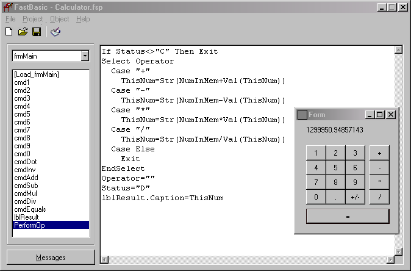



## FastBasic Compiler

### Description

FastBasic is a programming language made in Visual Basic 6. It is NOT a scripting language: FastBasic compiles to a p-code that is executed by a runtime (or Virtual Machine, whatever you prefer). The language itself is very simple. It only handles if's, do's, and things like that, but it can be expanded easily. Keep in mind that you can't do anything very useful in FastBasic, it is just an educational tool. Take a look at the examples provided to see some of the things it is capable of doing.
 
### More Info
 

             |
---                |---
**Submitted On**   |2003-04-16 01:43:20
**By**             |[Paul Guerra](https://github.com/Planet-Source-Code/PSCIndex/blob/master/ByAuthor/paul-guerra.md)
**Level**          |Advanced
**User Rating**    |5.0 (40 globes from 8 users)
**Compatibility**  |VB 6\.0
**Category**       |[Complete Applications](https://github.com/Planet-Source-Code/PSCIndex/blob/master/ByCategory/complete-applications__1-27.md)
**World**          |[Visual Basic](https://github.com/Planet-Source-Code/PSCIndex/blob/master/ByWorld/visual-basic.md)
**Archive File**   |[FastBasic\_1574374162003\.zip](https://github.com/Planet-Source-Code/paul-guerra-fastbasic-compiler__1-44772/archive/master.zip)

